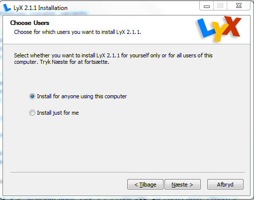
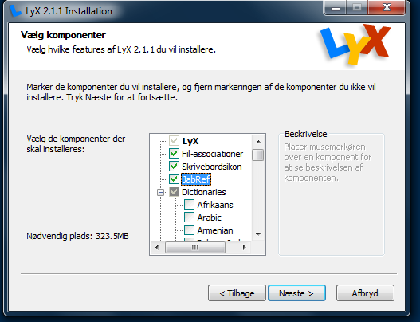
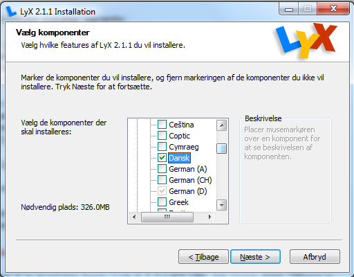
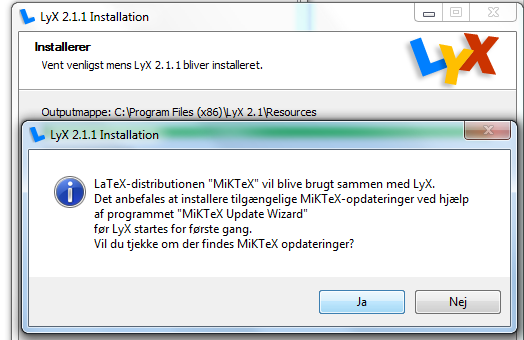
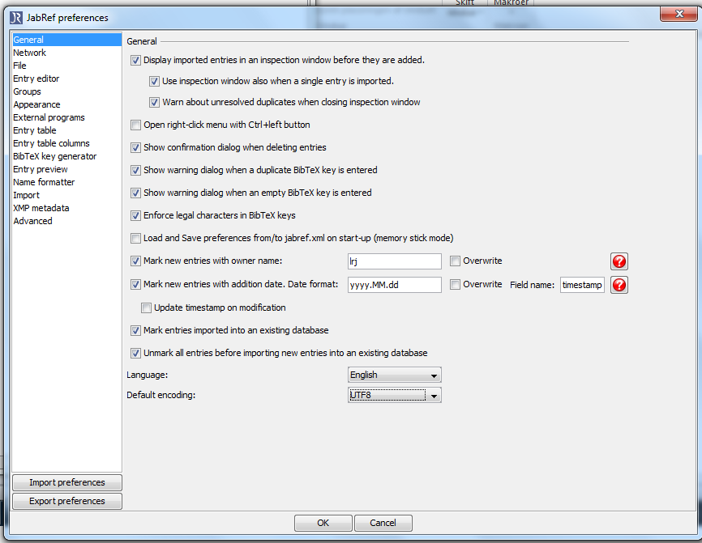

Installation af nødvendige programmer
-------------------------------------

##Installation af Lyx

Lyx er er en grafisk brugerflade til programmet Latex. Latex er et typografisk program der er god til at håndterer store dokumenter på en professionel måde. Lyx kan derfor kun fungere hvis Latex er installeret, Windows installations programmet tager selv hånd om  det mens Mac brugere selv skal installere det først. Yderligere har vi brug for et program til at håndtere litteratur henvisninger, her bruger vi JabRef der findes til alle platforme.

- __Windows__: Hvis du ikke har en latex installation så installer LyX-2.1.4-Bundle-2.exe fra [http://lyx.org/Download](http://lyx.org/Download). Følg kogebogen nedenfor
- __Mac__: Installer først MacTex fra [http://www.tug.org/mactex/](http://www.tug.org/mactex/) og JabRef fra [http://jabref.sourceforge.net/download.php](http://jabref.sourceforge.net/download.php): Tag latest stable version. Til sidst Lyx LyX-2.1.4+qt4-cocoa.dmg fra [http://lyx.org/Download](http://lyx.org/Download). Installationen forgår så i omvendt række følge af koge bogen men ellers på samme måde.

#### Lyx
 
(Screen shoot er for installation af lyx 2.1.1. Jeg går ud fra at det er det samme med 2.1.4, hvis ikke så sig lige til). Under installation af lyx er der følgende valg: Vælg: _Install for anyone using this computer_

Under komponenter vælg _JabRef_

 og under _Dictionaries_ vælg _Dansk_

Vælg eventuelt under _Thesaurus_ engelsk og dansk

#### MikTex
Under window installerer Lyx-installation samtidig MikTex: Brug alle valg foreslået af MikTex. 

#### JabRef

Under window installerer Lyx også JabRef - det samme her brug alle valg der foreslås

#### MikTex

Sig ja til at opdaterer MikTex

## Efter Installationen af Lyx

#### JabRef

Åben JabRef og sæt encoding til UTF8. Gå i menuen: Options > Preferences > General nederst på siden sæt _Default encoding_ til _UTF8_
 

#### Lyx

Start lyx: Når lyx starter første gang tager det noget tid hav tålmodighed. --- Når lyx starter første gang vil MikTex installere flere pakker, sig derfor ja til advarselen to gange

Når lyx endelig starter tryk på øjnene øverst til venstre, MikTex vil igen installerer nogle pakker sig trygt ja til det og læs det pdf dokument der åbnes i acrobat reader

[Instalation af SourceTree og ERMreport pakker](SourcTreeInstall.md)