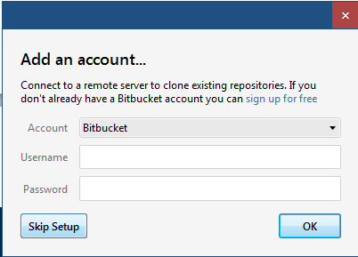

Instalation af SourceTree og ERMreport pakker
-------------------------------------------

Hvis du ikke har insatlleret lyx så start på [her](Install.md)

##Installation af SourceTree

SourceTree er en grafisk brugerflade til versions kontrolsystemet _Git_. Det kan installeres fra Atlassian: [http://www.sourcetreeapp.com](http://www.sourcetreeapp.com)

Sig bare ja til global ignor file:


Skip setup af account



Sig nej til ssh key

## Efter installation af SourceTree

#### Registrer programmet
Start Sourcetree og gå til menuen File > Registration... og registrer, det er gratis.

#### Opsætning af ERMreport

Vi skal bruge Git (SourceTree) til flere ting som det første clone ERMreport.cls filer og ERMreport.layout filer der findes på [http://github.com/larsJonsen/ERMreport](http://github.com/larsJonsen/ERMreport). Grunden til at vi skal bruge git er at det er at jeg fortsat arbejder på programmet. Ved at bruge Git er det nemt at opdaterer

I øverste venstre hjørne tryk på Clone/new

- Under _Source Path / URL:_ skriv _http://github.com/larsJonsen/ERMreport_ 
- Under _Destination Path:_ skriver du i Windows _C:\Users\ \<bruger navn> \Git\ERMreport_ i Mac og Linux _~/Git/ERMreport_
- Tryk på Clone og en copi af fillerne vil komme ned på din maskine (hvis du har internet adgang)


#### Efter kloning af ERMReport

MikTex skal vide hvor den kan finde ermreprort.cls filen og lyx skal finde ermreport.layout

###### Windows

Åben en administarter comand promt: Tryk på start knappen og skriv _cmd_ og tryk __shift-crtl-enter__ for at starte en administrator terminal.


I terminalen kopieres følgende ind: 

```bat
mkdir %AppData%\MikTex\2.9\tex\latex
mklink /j %AppData%\MikTex\2.9\tex\latex\ERMreport %userprofile%\Git\ERMreport\latex
initexmf -u

mklink %AppData%\LyX2.1\layouts\ermreport.layout %userprofile%\Git\ERMreport\lyx\ermreport.layout
mklink %AppData%\LyX2.1\templates\erm.lyx %userprofile%\Git\ERMreport\lyx\erm.lyx
```


Første linje laver en directory i MikTex´s lokale mappe for tex filer. Anden linje laver en junction (som symbolske links til mapper heder i Windows). Herefter opdateres MikTex database. Så laver vi et symbolsk link så Lyx kan se layoutfile og template filen

Herefter køres i Lyx menuen Værktøj > Genkonfigurer

###### Mac

__Her skal jeg lige have hjælp af en emd en mac så jeg får det rigtig__

Åben en terminal. I terminalen kopieres følgende ind:

```sh
sudo ln -s ~/Git/ERMreport/latex /usr/local/texlive/texmf-local/tex/latex/ERMreport
sudo texhash
ln -s ~/Git/ERMreport/lyx/ermreport.layout ~/Library/Application\ Support/LyX-2.1/layouts/ermreport.layout
ln -s ~/Git/ERMreport/lyx/erm.lyx ~/Library/Application\ Support/LyX-2.1/templates/erm.lyx
```


Efter de første linje vil promten bede om dit password

Herefter køres i lyx Værktøj > Genkonfigurer


## Biber

Latex og dets originale  system er et gammelt latex fra 1984 og Bibtex fra 1985. Der er nogle ting der er løbet fra Bibtex, det arbejder ikke med utf8, (har svært ved æ,ø og å) der findes ikke ordentlige style files der har url og doi på den rigtige måde. Den nye program hedder Biblatex og Biber. Det er det vi bruger. Lyx skal derfor sætes til at bruge biber:

##### Under Mac
Gå til Lyx > Preference under Output > Latex under *bibliograpy generation* set *Processor* til **biber** 