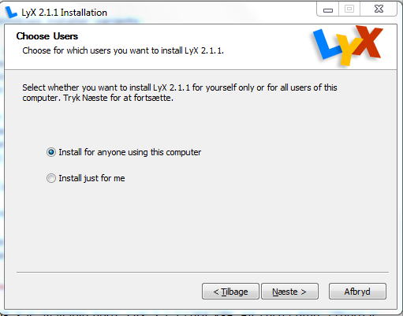
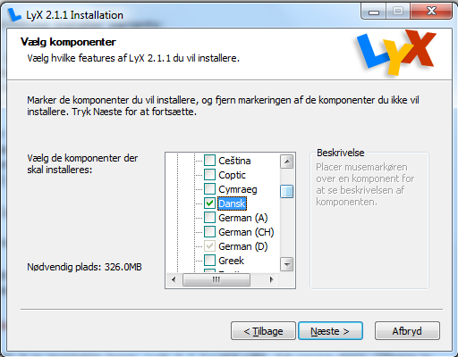
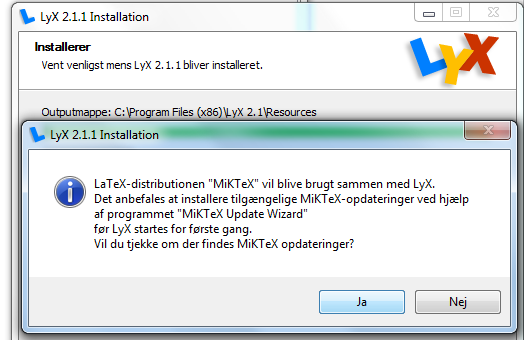

Installation af nødvendige programmer
-------------------------------------

##Installation af Lyx

Installer af lyx 

Lyx er ern grafisk brugerflade til programmet Latex. Latex er et typografisk program der er god til at håndterer store dokiumenter på en profesionel måde. Lyx kan derfor kun fungere hvis Latex er installeret, Windows installations programet tager sel hånd om  det mens Mac brugere selv skal installere det først. Yderligere har vi brug for et program til at håndtere litteratur henvisninger, her bruger vi JabRef der findes tialle platforme.

- __Windows__: Hvis du ikke har en latex installation så installer LyX-2.1.1-Bundle-1.exe fra [http://lyx.org/Download](http://lyx.org/Download). Følg kogebogen nedenfor
- __Mac__: Installer først MacTex fra [http://www.tug.org/mactex/](http://www.tug.org/mactex/) og JabRef fra [http://www.macupdate.com/app/mac/19869/jabref](http://www.macupdate.com/app/mac/19869/jabref) og så Lyx LyX-2.1.1+qt4-x86_64-cocoa.dmg fra [http://lyx.org/Download](http://lyx.org/Download). Installationen fregår så i omvendt række følge af koge bogen men ellers på samme måde.

#### Lyx
 
Under installation af lyx er der følgende valg: Vælg: _Install for anyone using this computer_

Under komponenter vælg _JabRef_

 og under _Dictionaries_ vælg _Dansk_

Vælg eventuelt under _Thesaurus_ engelsk og dansk

#### MikTex
Under window instalerer Lyx-installation samtidig MikTex: Brug alle valg foreslået af MikTex. 

#### JabRef

Under window instalerer Lyx også JabRef - det samme her brug alle valg der foreslås

#### MikTex

Sig ja til at opdaterer MikTex

## Efter Installationen af Lyx

#### JabRef

Åben JabRef og sæt encoding til UTF8. Gå i menuen: Options > Preferences > General nederst på siden sæt _Default encoding_ til _UTF8_
 

#### Lyx

Start lyx: Når lyx starter første gang tager det noget tid hav tålmodighed. --- Når lyx starter første gang vil MikTex installere flere pakker, sig derfor ja til advarselen to gange

Når lyx endelig starter tryk på øjene øverst til venstre, MikTex vil igen installerer nogle pakker sig trygt ja til det og læs det pdf dokument der åbnes i acrobat reader

##Installation af SourceTree

SourceTree er en grafisk brugerflade til versions kontrolsystemet _Git_. Det kan installeres fra Atlassian: [http://www.sourcetreeapp.com](http://www.sourcetreeapp.com)

Sig bare ja til global ignor file:

Skip setup af account

Sig nej til ssh key

## Efter installatio af SourceTree

#### Registrer programmet
Start Sourcetree og gå til menuen File > Registration... og registrer, det er gratis.

#### Opsætning af ERMreport

Vi skal bruge G til flere ting som det første clone ERMreport.cls filer og ERMreport.layout filer der findes på [http://github.com/larsJonsen/ERMreport](http://github.com/larsJonsen/ERMreport). Grunden til at vi skal bruge git er at det er at jeg fortsat arbejder på programmet. Ved at bruge Git er det nemt at opdaterer

I øverste venstre hjørne tryk på Clone/new

- Under _Destination Path / URL:_ skriv _http://github.com/larsJonsen/ERMreport_ 
- Under _Destination Path:_ skriver du i Windows _C:\Users\<bruger navn>\Git\ERMreport_ i Mac og Linux _~/Git/ERMreport_
- Tryk på Clone og en copi af fillerne vil komme ned på din maskine (hvis du har internet adgang)

#### Efter cloning af ERMReport

MikTex skal vide hvor den kan finde ermreprort.cls filen og lyx skal finde ermreport.layout

###### Windows

Åben en administarter comand promt: Tryk på start knappen og skriv _cmd_ og tryk __shift-crtl-enter__ for at starte en administrator terminal.

I terminalen kopieres følgende ind: 

`mkdir %AppData%\MikTex\2.9\tex\latex`
`mklink /j %AppData%\MikTex\2.9\tex\latex\ERMreport %userprofile%\Git\ERMreport\latex`
`initexmf -u`
`mklink /d %AppData%\LyX2.1\layouts\ermreport.layout %userprofile%\Git\ERMreport\lyx\ermreport.layout`
`mklink /d %AppData%\LyX2.1\templates\erm.lyx %userprofile%\Git\ERMreport\lyx\erm.lyx`

Første linje laver en directory i MikTex´s lokale mappe for tex filer. Anden linje laver en junction (som symbolske links til mapper heder i Windows). Herefter opdateres MikTex database. Så laver vi et symbolsk link så Lyx kan se layoutfile og template filen

Herefter køres i lyx Værktøj > Genkonfigurer

###### Mac

__Her skal jeg lige have hjælp af en emd en mac så jeg får det rigtig__

Åben en terminal. I terminalen kopieres følgende ind:

`sudo ln -s ~/Git/ERMreport/latex /usr/local/texlive/texmf-local/tex/latex/ERMreport`
`sudo texhash`
`ln -s ~/Git/ERMreport/lyx/ermreport.layout ~/Library/Application\ Support/LyX-2.1/layouts/ermreport.layout`
`ln -s ~/Git/ERMreport/lyx/erm.lyx ~/Library/Application\ Support/LyX-2.1/templates/erm.lyx`

Efter de første linje vil promten bede om dit password

Herefter køres i lyx Værktøj > Genkonfigurer

